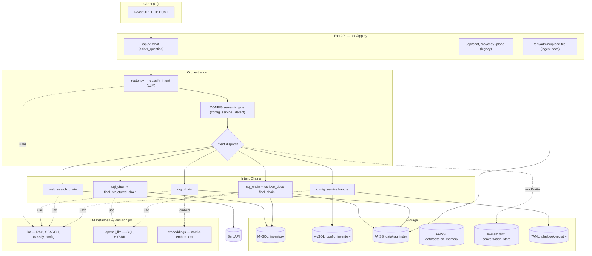
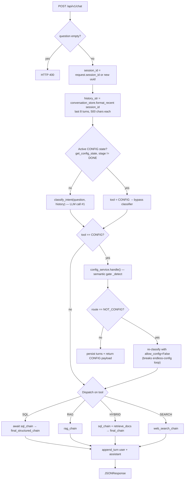
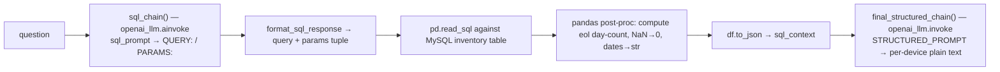
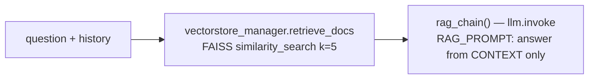
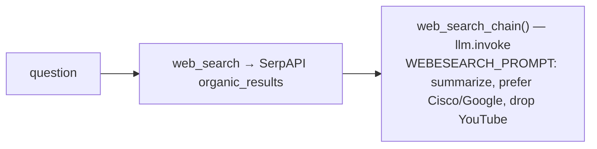
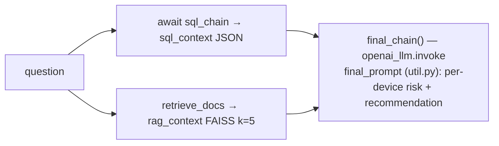
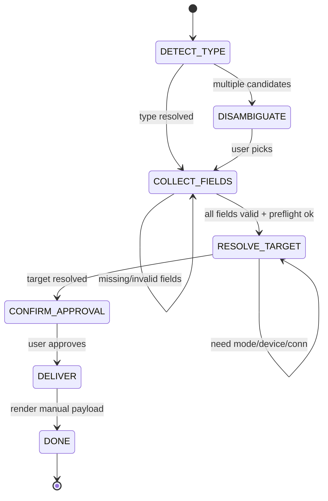

# SmartShift-AI — End-to-End Architecture

> **Source of truth:** This document is reconstructed directly from the code (commit `35c7dc0`), not from prior docs. Where older docs conflict, trust this.

---

## 0. Tech Stack at a Glance

| Layer | Technology |
|---|---|
| API server | FastAPI + Uvicorn (`app/app.py`), CORS open |
| Intent router | LLM-based, `app/router.py` |
| LLM providers | Ollama / OpenAI / Azure OpenAI / LocalAI / llama.cpp (`app/decision.py`) |
| Relational store | MySQL `inventory` DB (`mysql+pymysql`) — SQL & HYBRID intents |
| Config device store | MySQL `config_inventory` table — CONFIG intent targeting |
| RAG knowledge base | **FAISS** index on disk at `data/rag_index/` |
| Per-session semantic memory | FAISS files at `data/session_memory/<session_id>/` |
| Conversation / CONFIG state | **In-memory Python dict**, 2h TTL (process-local) |
| Playbook registry | YAML files in `repositories/playbook-registry/` |
| Web search | SerpAPI |
| LLM cache | **None active** (LangChain `InMemoryCache` is commented out) |

---

## 1. System Component Diagram

---

## 2. Master Request Flow (entry → classification → dispatch)

**Primary endpoint:** `POST /api/v1/chat` → `askv1_question()` (`app/app.py:181`). Synchronous JSON response (no streaming).

**Intent classification** (`classify_intent`, `router.py:9`):
- Single `llm.invoke(INTENT_CLASSIFIER_PROMPT)` call.
- Override: if response text contains **both** `SQL` and `RAG` → `HYBRID`.
- Else first-match scan over `(CONFIG, HYBRID, SQL, RAG, SEARCH)`; CONFIG filtered out when `allow_config=False`.
- Safe default → `SEARCH`.

**Two config gates** (the "endless config loop" fix):
1. **Resume gate** (`app.py:206`): an in-progress `ConfigState` (stage ≠ DONE) forces CONFIG, skipping the classifier.
2. **Semantic gate** (`app.py:217`): even when classified CONFIG, `config_service._detect` re-checks. A `NOT_CONFIG` route triggers re-classification with CONFIG disabled, preventing bounce-back.

---

## 3. The Five Intents

### 3.1 SQL Intent

- **LLM calls:** 2 (NL→SQL, then format output).
- **DB:** direct `pd.read_sql` on `inventory` table. Safety = prompt + `%s` params + `safe_text()` escaping. **No SQL allowlist/AST validation.**

### 3.2 RAG Intent

- **Vectorstore:** FAISS at `data/rag_index/` (loaded at startup). Embeddings = `nomic-embed-text:latest`.
- **Ingestion:** offline via `/api/admin/upload-file` → `add_documents()` (batches of 200, 429-retry, incremental save).
- **LLM calls:** 1.

### 3.3 SEARCH Intent

- **LLM calls:** 1. Returns `[]` if `SERPAPI_API_KEY` missing.

### 3.4 HYBRID Intent

- **Risk classification is done BY THE LLM** inside `final_prompt`, from the pandas-computed `eol` day-count:
  - CRITICAL ≤30d · HIGH 31–90d · MEDIUM 91–180d · LOW >180d · UNKNOWN (no date)
- **LLM calls:** 2 (SQL gen + final synthesis).

### 3.5 CONFIG Intent — see §4.

---

## 4. CONFIG Intent — Stateful Stage Machine

Entry: `ConfigService.handle(message, session_id, form_values)` (`config_service.py:777`). Runs as a **top-to-bottom pipeline each turn**; `state.stage` records where it stopped. State persisted in `conversation_store` (in-mem, 2h TTL).

**LLM calls in CONFIG (6 possible, all in `config_chain.py`, each Pydantic-parsed):**

| # | Function | When | Produces |
|---|---|---|---|
| 1 | `detect_type` | type not keyword-resolvable | `{route, config_type, confidence, candidates}` — also the **semantic gate** |
| 2 | `build_form` | first collection turn, forms on | form copy **+** extracted values (one combined call) |
| 3 | `extract_fields` | forms off / fallback / typed reply | field values dict |
| 4 | `preflight_validate` | after deterministic checks | validates values vs **playbook YAML**; fail-open; cached by signature |
| 5 | `extract_connection` | standalone/free-text target only | connection details |
| 6 | `phrase_question` | text-question paths only | cosmetic rewrite |

**Form mechanism (LLM-call reduction):**
- First turn: `build_form` = 1 call doing copy + extraction (vs 2). Form copy cached in `state.form_cache`.
- Subsequent form submissions arrive as structured `form_values` → merged with **zero LLM calls** (`_merge_and_validate`).

**Targeting (`_resolve_target`):**
- **Integrated** — picks device(s) from `config_inventory` MySQL table; credentials read securely (password never surfaced).
- **Standalone** — user supplies device_name/ansible_host/username/password (session-only).

**Playbook registry (`config_registry.py`):** parses `repositories/playbook-registry/<category>/*.yml` headers for `config_type`, required/optional fields, target group, risk (high if `ios_config` + `lines:`). `ENRICHMENT` map adds keywords/examples/validators. ~20 config types.

**Delivery (`_render_manual`):** **manual only in v1 — no Ansible executed.** Produces: `ansible-playbook` command (with extra-vars JSON), verbatim playbook YAML, sample `inventory.ini` line (no password). Idempotent via SHA-256 signature of (config_type, collected). Automated path is stubbed ("coming soon").

---

## 5. LLM Instances (`decision.py`)

All built by `create_llm_instance()` from env config (default ENV=`azure`; code fallback `MODEL=llama3.2:3b`, provider `ollama`, temp 0, top_p 0):

| Instance | Used by |
|---|---|
| `llm` | classify_intent, RAG, SEARCH, CONFIG chains, route_query, check_sufficiency |
| `openai_llm` | SQL, HYBRID (real OpenAI-compatible instance if provider is openai/azure/localai; else aliases `llm_chat`) |
| `sql_llm`, `llm_chat` | created but `sql_llm` unused; `llm_chat` only as `openai_llm` fallback |
| `embeddings` | RAG + memory (`nomic-embed-text:latest`) |

**Cache:** `set_llm_cache(InMemoryCache())` is **commented out** → no response/semantic/embedding cache active.

---

## 6. Memory & Storage (two distinct memory systems)

| System | Backend | Scope | Used for |
|---|---|---|---|
| **conversation_store** | In-memory dict, 2h TTL, last 8 turns | per session, per process | intent classification + CONFIG state + history injection via `with_history()` |
| **memory.py** | FAISS files `data/session_memory/<id>` | per session, on disk | semantic recall (`CONVERSTIONAL_MEMORY_PROMPT`); k=5; embeds with `OllamaEmbeddings(MODEL)` |
| **inventory** | MySQL | global | SQL/HYBRID device records |
| **config_inventory** | MySQL | global | CONFIG integrated targeting (seeded, idempotent) |
| **rag_index** | FAISS `data/rag_index/` | global | RAG knowledge base |
| **playbook-registry** | YAML files | global | CONFIG playbook contracts |

---

## 7. LLM Call Count Per Intent (cost view)

| Intent | LLM calls (typical) |
|---|---|
| Classification | 1 (every request) |
| SQL | +2 (gen SQL, format) |
| RAG | +1 |
| SEARCH | +1 |
| HYBRID | +2 (SQL gen, synthesis) |
| CONFIG | 1–6 across the multi-turn flow (forms minimize this) |
