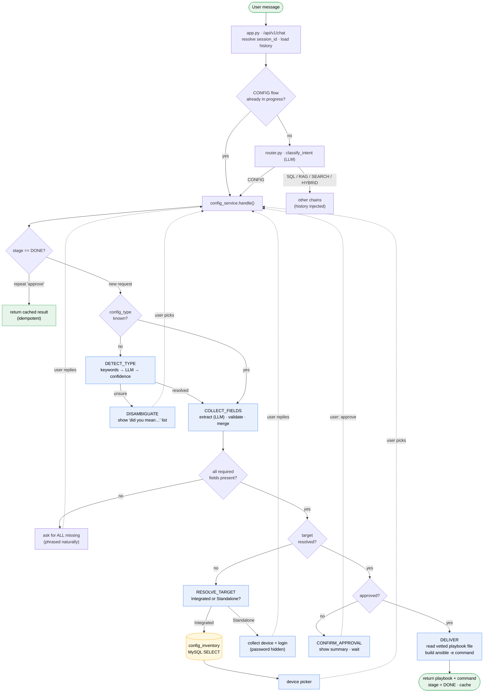
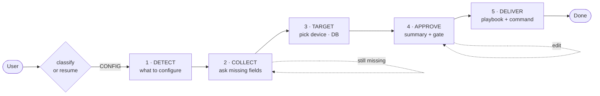

# CONFIG Intent — Flow Diagram (review slide)

Two formats below: **Mermaid** (renders in GitHub, VS Code, Notion, many slide tools) and an
**ASCII** fallback (paste anywhere). Both show one request flowing through the system.

---

## 1. Mermaid — full flow



---

## 2. Mermaid — condensed (cleaner for a single slide)



---

## 3. ASCII fallback

```
                         ┌─────────────────────────────┐
   User message ───────► │ app.py  /api/v1/chat         │
                         │  • session_id  • load history│
                         └───────────────┬──────────────┘
                                         ▼
                            CONFIG already in progress?
                              │ yes               │ no
                              ▼                   ▼
                              │           router.py: classify_intent
                              │             │CONFIG     │ SQL/RAG/SEARCH/HYBRID
                              │             ▼                   ▼
                              └────────►  config_service.handle()   other chains (+history)
                                              │
        ┌─────────────────────────────────────┼─────────────────────────────────────┐
        ▼                                                                             │
  ┌───────────────┐  unsure   ┌──────────────┐                                       │
  │ 1. DETECT     │ ────────► │ DISAMBIGUATE │ ──"did you mean…"── user picks ───────►┤
  │ type?         │           └──────────────┘                                       │
  │ keyword→LLM   │ resolved                                                          │
  └──────┬────────┘                                                                   │
         ▼                                                                            │
  ┌───────────────┐  missing  ┌───────────────────────┐                              │
  │ 2. COLLECT    │ ────────► │ ask for ALL missing    │ ── user replies ────────────►┤
  │ extract+valid │           │ (cumulative, phrased)  │                              │
  └──────┬────────┘  complete └───────────────────────┘                              │
         ▼                                                                            │
  ┌───────────────┐           ┌──────────────────────────┐                           │
  │ 3. TARGET     │ Integrated│  config_inventory (MySQL) │ → device picker ──────────►┤
  │ mode?         │ ──────────►  SELECT … FROM …           │                           │
  │               │ Standalone│  collect device+login     │ (password hidden) ────────►┤
  └──────┬────────┘           └──────────────────────────┘                           │
         ▼                                                                            │
  ┌───────────────┐  not yet  ┌───────────────────────┐                              │
  │ 4. APPROVE    │ ────────► │ show summary · WAIT    │ ── "approve" ───────────────►┘
  │ gate          │           │ (edits re-open gate)   │
  └──────┬────────┘ approved  └───────────────────────┘
         ▼
  ┌─────────────────────────────────────────────┐
  │ 5. DELIVER                                   │
  │  • read vetted playbook FILE from registry   │
  │  • build  ansible-playbook … -e '{vars}'     │
  │  • return playbook + command   (no device    │
  │    is contacted — manual mode)               │
  └──────────────────┬──────────────────────────┘
                     ▼
              stage = DONE · cache result
          (repeat "approve" → returns cached, no re-apply)
```

---

## 4. One-line legend for the slide

> **DETECT → COLLECT → TARGET → APPROVE → DELIVER** — a 5-step refinement loop.
> Each step either advances or asks one question and waits. Nothing runs on a device:
> the output is a vetted playbook + the exact command to run it.
