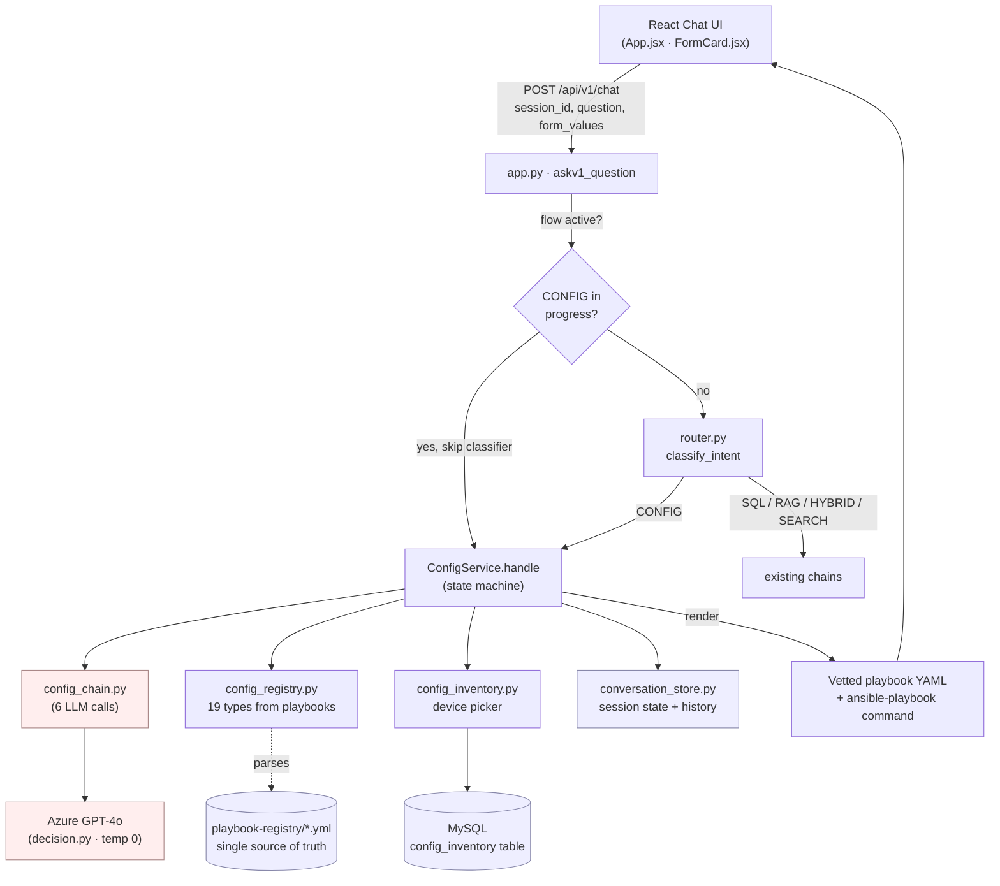
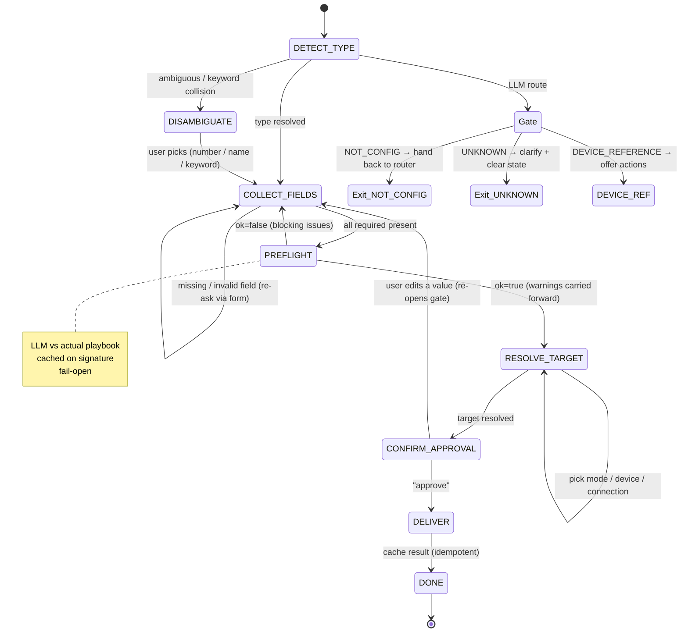

# CONFIG Intent — Code Review & Demo Brief

> Prepared for the code review / demo. Covers every file, the key functions, all LLM
> calls, data storage, caching, chaining, pre-flight, and the disambiguation/gate stages,
> plus a ready-to-run demo script and likely-question prep.
>
> Platform: **Cisco IOS** · LLM: **Azure OpenAI (GPT-4o)** · Delivery: **Manual only (v1)** ·
> Workspace: `smartshift-ai/`

---

## 0. The one-paragraph summary (say this first)

The assistant already answers questions through four intents — **SQL** (inventory),
**RAG** (documents), **HYBRID**, **SEARCH** (web). **CONFIG** is the fifth, and it is
different: it doesn't answer, it *acts*. It turns a plain-English request like *"create
VLAN 30 named FINANCE"* into a **vetted, ready-to-run Ansible playbook + command**, after
a guided, validated, **human-approved** multi-turn conversation. Critically, the LLM never
writes router CLI — it only *classifies intent, extracts the values the user typed, and
sanity-checks them*. The actual configuration comes from pre-written, version-controlled
playbooks. In v1 it never touches a device; it hands the engineer the playbook to run.

**The headline design principle:** the LLM is kept on a short leash. Deterministic code
(the registry, validators, the state machine) owns every decision that matters; the LLM
only does the fuzzy language work that code can't.

---

## 1. Files involved in the CONFIG intent

### Core (the feature lives here)

| File | Role |
|---|---|
| [app/services/config_service.py](../app/services/config_service.py) | **The state machine** — the heart of the feature. One `handle()` call per user turn drives the whole lifecycle. |
| [app/chains/config_chain.py](../app/chains/config_chain.py) | **All CONFIG LLM calls** — type detection, field extraction, form building, connection extraction, pre-flight, phrasing. Each is isolated, parsed, and fail-safe. |
| [app/config_registry.py](../app/config_registry.py) | **Single source of truth.** Builds the catalogue of config types by parsing the vetted playbooks on disk + an `ENRICHMENT` table (keywords, prompts, validators). 19 types today. |
| [app/config_inventory.py](../app/config_inventory.py) | Device source for the **Integrated** target picker. Own `config_inventory` MySQL table; passwords never surfaced. |
| [app/services/conversation_store.py](../app/services/conversation_store.py) | **Per-session state + chat history** — makes the flow multi-turn and idempotent. |
| [app/models.py](../app/models.py) | Pydantic models: `ConfigState`, `ConfigStage` (the enum of lifecycle stages), and the LLM output schemas (`ConfigTypeDetection`, `ConfigFieldExtraction`, `ConfigFormBuild`, `ConfigPreflight`, `ConfigConnectionExtraction`). |
| [app/config.py](../app/config.py) | Feature flags: `CONFIG_REQUIRE_APPROVAL`, `CONFIG_LLM_PHRASING`, `CONFIG_LLM_PREFLIGHT`, `CONFIG_USE_FORMS`. |
| [app/prompts.py](../app/prompts.py) | The CONFIG prompt templates (lines 93–255) + the top-level `INTENT_CLASSIFIER_PROMPT`. |

### Wiring / entry points

| File | Role |
|---|---|
| [app/app.py](../app/app.py) | `POST /api/v1/chat` (`askv1_question`) — resumes an in-progress CONFIG flow, calls `config_service.handle()`, handles the `NOT_CONFIG` hand-back, seeds the inventory at startup. |
| [app/router.py](../app/router.py) | `classify_intent()` — picks the intent; CONFIG wins on an imperative. Has an `allow_config` switch for the gate hand-back. |
| [app/decision.py](../app/decision.py) | Builds the shared `llm` instance (Azure GPT-4o, temperature 0). All CONFIG chains import this. |

### Data / content (not code, but part of the contract)

| Path | Role |
|---|---|
| [repositories/playbook-registry/](../repositories/playbook-registry/) | The 19 vetted Ansible playbooks, grouped by category (`management/`, `layer2/`, `layer3/`, `security/`, `services/`, `redundancy/`, `segmentation/`). **Each playbook IS the contract.** |
| [ui/src/components/FormCard.jsx](../ui/src/components/FormCard.jsx) | Renders the dynamic form; masks `type:"password"`. |
| [ui/src/App.jsx](../ui/src/App.jsx) | Chat client; submits `form_values`, redacts secrets in the message bubble. |

### Companion docs

`CONFIG_INTENT_PLAN.md` (the spec, "§" references throughout the code point here),
`CONFIG_INTENT_OVERVIEW.md`, `CONFIG_FLOW_DIAGRAM.md`, `CONFIG_INTENT_TEST_PROMPTS.md`,
`SESSION_CONTEXT.md` (latest handoff).

---

## 2. Important functions (what to point at during the walkthrough)

### `ConfigService.handle(message, session_id, form_values)` — [config_service.py:624](../app/services/config_service.py#L624)
The single entry point, called **once per user turn**. It is a re-entrant state machine: it
loads the saved `ConfigState`, advances it by exactly the work this turn allows, persists it,
and returns a response dict. Walk it top-to-bottom in the review — it reads as a numbered
pipeline:

1. **Load / reset state** — fresh `ConfigState` if none; if the prior flow is `DONE`, decide
   between an idempotent re-send and a brand-new request (carrying the last delivery forward).
2. **Cancel / automated / attempts-cap** guards (lines 645–663).
3. **Detect config type** (lines 665–714) — keyword → LLM gate → disambiguate.
4. **Gather field values** (lines 721–756) — form submit (no LLM), or LLM extraction.
5. **Recompute missing required fields** (lines 757–767) — re-ask via form if any.
6. **Idempotency short-circuit** (lines 769–777) — identical already-delivered request → cached result.
7. **Pre-flight** (lines 779–793) — LLM semantic/safety validation.
8. **Resolve target** (lines 795–800) — mode → device picker / connection details.
9. **Approval gate** (lines 802–808) — never delivers without explicit approval.
10. **Deliver** (lines 810–838) — render playbook + command, cache the result, set `DONE`.

### `ConfigService._detect(message, history)` — [config_service.py:841](../app/services/config_service.py#L841)
The brain of type resolution **and** the semantic gate (see §7/§8). Returns
`(route, resolved_type, candidates)`. Key efficiency trick: **one keyword hit = no LLM call**;
the LLM is only consulted when keywords miss or collide.

### `config_registry.parse_playbook_contract(text)` — [config_registry.py:295](../app/config_registry.py#L295)
Derives a type's contract by regex-parsing the playbook header comments
(`# CONFIG intent:`, `# required_fields:`, `# optional:`), the `target_hosts` default, and
risk (`ios_config` + `lines:` ⇒ high-risk). **This is why adding a type needs no code change.**

### `_validate(meta, value)` — [config_service.py:93](../app/services/config_service.py#L93)
Deterministic per-field validation/normalisation: `vlan_id` (1–4094), `ipv4`, `prefix`
(0–32), `int`, `list`, `state` (present/absent). The LLM never validates — code does.
`_merge_and_validate` ([:132](../app/services/config_service.py#L132)) applies it across an
extracted dict and **drops invalid values rather than storing them**.

### `_render_manual(spec, state)` — [config_service.py:198](../app/services/config_service.py#L198)
Produces the deliverable: the unchanged vetted playbook YAML + the
`ansible-playbook -i inventory.ini <playbook> -e '<json>'` command, with a `--check` warning
on high-risk types.

### `_signature(config_type, collected)` — [config_service.py:226](../app/services/config_service.py#L226)
SHA-256 of `{type, collected fields}` — the key behind **all three caches** (pre-flight,
idempotency, delivery). Target is deliberately *not* part of it (the request is the change,
not where it runs).

### `_redact` / `_redact_target` — [config_service.py:251](../app/services/config_service.py#L251)
Mask `secret=True` fields (passwords, shared keys) in everything echoed to the client.

---

## 3. Every LLM call in the CONFIG intent

The LLM is Azure GPT-4o, **temperature 0** ([decision.py](../app/decision.py)), shared as
the `llm` singleton. Every CONFIG call uses LangChain's `PydanticOutputParser` so the model
must return a **schema-constrained JSON object**, and every call is wrapped in try/except
with a safe fallback. There are **6 CONFIG-internal calls** plus the **1 top-level router call**.

| # | Function (file) | Prompt | Purpose | On failure |
|---|---|---|---|---|
| 0 | `classify_intent` ([router.py](../app/router.py)) | `INTENT_CLASSIFIER_PROMPT` | Top-level: is this turn CONFIG/SQL/RAG/HYBRID/SEARCH? | defaults to `SEARCH` |
| 1 | `detect_type` ([config_chain.py:43](../app/chains/config_chain.py#L43)) | `CONFIG_TYPE_DETECT_PROMPT` | **Semantic gate route** + best `config_type` + confidence + candidates | returns `CONFIG_ACTION` w/ no type → disambiguate (fail-safe) |
| 2 | `build_form` ([config_chain.py:135](../app/chains/config_chain.py#L135)) | `CONFIG_FORM_BUILD_PROMPT` | **One combined call**: author the form copy AND extract values already in the opening message | returns `None` → static form copy + `extract_fields` |
| 3 | `extract_fields` ([config_chain.py:78](../app/chains/config_chain.py#L78)) | `CONFIG_FIELD_EXTRACT_PROMPT` | Pull stated field values from a follow-up message (forms-off, or free-text reply after a form) | returns `{}` (no values) |
| 4 | `extract_connection` ([config_chain.py:119](../app/chains/config_chain.py#L119)) | `CONFIG_CONNECTION_EXTRACT_PROMPT` | Pull device name/IP/user/password from a free-text standalone reply | returns `{}` |
| 5 | `preflight_validate` ([config_chain.py:170](../app/chains/config_chain.py#L170)) | `CONFIG_PREFLIGHT_PROMPT` | Semantic/safety check of collected values **against the actual playbook text** | **fail-open**: `ok=True` |
| 6 | `phrase_question` ([config_chain.py:195](../app/chains/config_chain.py#L195)) | `CONFIG_QUESTION_PROMPT` | Polish a deterministic follow-up so it reads naturally (forms-off path) | returns the original text |

**Three things to emphasise about the LLM calls:**

1. **Constrained, never generative of config.** Every extraction prompt says *"NEVER invent
   values"* and is limited to the registry's exact field names; results are filtered to
   `allowed = required ∪ optional` ([config_chain.py:108](../app/chains/config_chain.py#L108)).
   The LLM can only echo what the user said — it cannot hallucinate a VLAN ID or an IP.
2. **The router call is reused, not duplicated.** The semantic gate route rides on the
   *existing* `detect_type` call — no extra round-trip ([config_chain.py docstring](../app/chains/config_chain.py)).
3. **Worst case per turn is ~1 LLM call.** A keyword-resolved type needs **zero**
   (`detect_type` skipped); form submissions need **zero** (structured merge). Pre-flight is
   cached. So most turns are cheap.

---

## 4. Data storage in the CONFIG intent

There are four distinct stores, each with a clear lifetime:

### 4.1 Session state — in-memory, per-process ([conversation_store.py](../app/services/conversation_store.py))
- A module-level singleton `conversation_store` holds a `dict[session_id → ConversationState]`.
- Each `ConversationState` carries the **chat history** (`list[ChatMessage]`) and the
  **`ConfigState`** (the slot/lifecycle object from [models.py:90](../app/models.py#L90)).
- **TTL of 2 hours** (`SESSION_TTL`) — stale sessions are dropped on access, which also clears
  any half-finished CONFIG flow.
- This is the **MVP backend**. The docstring is explicit: production swaps Redis/SQLite behind
  the same interface, and it is per-process only (needs a shared backend for workers > 1).
  *Good thing to flag proactively in the review.*

### 4.2 What `ConfigState` persists between turns ([models.py:90](../app/models.py#L90))
`config_type`, `collected` (cumulative field→value), `missing_fields`, `candidates`, `stage`,
the pre-flight cache fields, the form cache, `target_mode`/`target_device`/`target_filling`,
`delivery_mode`, `approved`, `attempts`, and the idempotency keys (`last_executed_signature`,
`last_result`). **Secrets are held here in plaintext server-side only** and are redacted on
every echo/log.

### 4.3 Device inventory — MySQL ([config_inventory.py](../app/config_inventory.py))
- Its own `config_inventory` table in the same MySQL DB as the SQL flow (but separate from
  the `inventory` table the SQL/HYBRID intents query).
- `ensure_schema_and_seed()` runs at app startup — **idempotent, insert-only** (never
  overwrites existing rows; new seed devices get added on the next start).
- **Resilient:** if MySQL is unavailable, `list_devices()`/`get_device()` fall back to the
  in-memory `_SEED_DEVICES` so the picker keeps working in a degraded demo.
- The plaintext `password` column is **dummy demo data**; production → vault/secret reference.
  `InventoryDevice.public()` strips the password before it ever leaves the module.

### 4.4 Playbooks — files on disk ([repositories/playbook-registry/](../repositories/playbook-registry/))
The 19 `.yml` files are the source of truth for the contract and the delivered artifact.
Read at startup to build the registry, and re-read at delivery / pre-flight time.

---

## 5. Caching — what, what kind, and why

All three application caches key off `_signature(config_type, collected)` (SHA-256). Plus one
framework-level cache that is currently **disabled**.

| Cache | Where | Type | Why |
|---|---|---|---|
| **Pre-flight cache** | `state.preflight_sig` + `preflight_ok/issues/warnings` ([config_service.py:782](../app/services/config_service.py#L782)) | Per-signature memo on `ConfigState` | Pre-flight is an LLM call. Without the cache it would re-run **every turn** even when nothing changed. It only re-validates when the collected values actually change. |
| **Form-copy cache** | `state.form_cache` + `initial_extracted` flag ([config_service.py:733](../app/services/config_service.py#L733), [models.py:105](../app/models.py#L105)) | Once-per-flow memo | The LLM authors the form headings/descriptions **once** (combined with the first extraction). Later turns rebuild the form from cached copy — **no per-turn LLM** for the form. |
| **Idempotency / delivery cache** | `last_executed_signature` + `last_result` ([config_service.py:769](../app/services/config_service.py#L769), [:810](../app/services/config_service.py#L810)) | Result memo | An identical, already-delivered request returns the cached playbook instead of looping the user back through target/approval. Also powers the idempotent "approve" re-send after `DONE`. |
| **LangChain `InMemoryCache`** | [decision.py:13](../app/decision.py#L13) | Framework LLM response cache | **Commented out.** Worth mentioning: a global response cache is risky with temperature-0 structured calls across different sessions, so it's intentionally off. |

**Soundbite:** "We cache the two expensive things — the pre-flight LLM call and the form copy —
keyed on a content signature, so a turn that changes nothing costs nothing. And the final
delivery is memoised so re-asking for the same change is idempotent."

---

## 6. How chaining works (multi-turn conversation)

"Chaining" here means two things — turn-to-turn statefulness, and LLM-call composition.

### 6.1 Turn-to-turn chaining (the multi-turn loop)
- The frontend sends a stable `session_id` with every message.
- [app.py:206](../app/app.py#L206): **if a CONFIG flow is already in progress for that session
  (`stage != DONE`), the classifier is skipped entirely** and the turn is routed straight back
  into `config_service.handle()`. This is what keeps a half-finished VLAN request from being
  re-classified as SEARCH mid-conversation.
- Inside `handle()`, state is loaded at the top and `set_config_state()` is called before every
  early return, so the **next** turn resumes exactly where this one left off.
- `collected` is **cumulative** — each turn merges newly-extracted values onto what's already
  there, so the user can supply fields across several messages in any order.
- History (`_history_text`, last 8 turns, each truncated to 500 chars) is fed into the LLM
  calls so detection/extraction have context.

### 6.2 LLM-call chaining within a turn
A single turn can chain calls: e.g. first message → `detect_type` (resolve type) →
`build_form` (extract + author form). The output of one stage feeds the next, but each stage
is independently parsed and fail-safe, so a failure degrades gracefully instead of breaking
the chain (e.g. `build_form` returning `None` falls back to `extract_fields` + static copy).

### 6.3 The stages (`ConfigStage`, [models.py:79](../app/models.py#L79))
```
DETECT_TYPE → DISAMBIGUATE → COLLECT_FIELDS → RESOLVE_TARGET → CONFIRM_APPROVAL → DELIVER → DONE
```
Each `handle()` call moves the state machine forward by the minimum the input allows, and
persists. That's the chain.

---

## 7. Pre-flight — what it is and how it's implemented

**What:** A final **semantic & safety validation** of the collected values *against the actual
playbook that will consume them*, run **after** the deterministic checks pass but **before** the
approval gate. The deterministic `_validate` checks *format* (is this a valid IPv4? a VLAN in
range?); pre-flight asks the higher-order questions code can't: *Is every mandatory property the
playbook needs actually present and plausible? Are the values mutually consistent? Is there a
safety concern specific to this playbook (lock-out risk, non-idempotent step)?*

**How** ([preflight_validate, config_chain.py:170](../app/chains/config_chain.py#L170) +
[handle, config_service.py:779](../app/services/config_service.py#L779)):
1. Read the vetted playbook YAML (`_playbook_text`), truncated to 4000 chars.
2. Send it to the LLM with the collected values (**secrets redacted to `***`**), the required/
   optional field lists, and `CONFIG_PREFLIGHT_PROMPT`. The prompt grounds the model: *"Validate
   ONLY against what THIS playbook actually uses … set `ok=false` ONLY for a BLOCKING problem."*
3. Parse into `ConfigPreflight {ok, issues[], warnings[]}`.
4. If `ok=False` → bounce back to `COLLECT_FIELDS` with the issues; the user fixes and resends.
5. If `ok=True` with `warnings` → carry them to the **approval summary** as non-blocking heads-up.

**Two safety properties to call out:**
- **Fail-open** — any LLM/parse error returns `ok=True` ([config_chain.py:192](../app/chains/config_chain.py#L192)).
  An infrastructure hiccup must never block a valid request, *and the deterministic presence/format
  check already ran*, so failing open is safe.
- **Cached** — keyed on the collected-signature ([config_service.py:782](../app/services/config_service.py#L782)),
  so it runs only when the values change, not every turn. Gated by `CONFIG_LLM_PREFLIGHT`.

> Demo line: "Format validation is deterministic and free. Pre-flight is the LLM acting as a
> second pair of eyes against the *real* playbook — and it can only warn or block, never change a value."

---

## 8. Disambiguation (and the semantic gate) — what it solves and how

This is the most interesting recent work, so give it time. There are **two layers** that run
before the flow commits to a config type, both inside `_detect()`
([config_service.py:841](../app/services/config_service.py#L841)).

### 8.1 The problem
Natural-language config requests are messy in two ways:
1. The top-level router may say "CONFIG" for something that **isn't actually an actionable
   change** — e.g. *"configure C9800-L-F-K9"* (a product code, no change stated) or *"what's a
   VLAN?"* Forcing these into the config flow traps the user.
2. Even for real changes, the request may be **ambiguous** — *"set up the port"* could be an
   L2 switchport or an L3 IP interface; keywords can **collide** (multiple types match).

### 8.2 The semantic gate (layer 1 — the recent addition)
`detect_type` returns a **`route`**, one of `{CONFIG_ACTION, DEVICE_REFERENCE, UNKNOWN,
NOT_CONFIG}` — a verdict on *whether a real config action exists at all*, decided **before** any
type mapping. The route rides on the **same** `detect_type` LLM call (no extra round-trip), and
`handle()` branches on it ([config_service.py:679](../app/services/config_service.py#L679)):
- **`DEVICE_REFERENCE`** → "you named a device but didn't say what to change" + offer the
  actions we support.
- **`UNKNOWN`** → one clarifying question, and **clear the CONFIG state** so the next turn is
  re-classified normally (don't trap the session).
- **`NOT_CONFIG`** → the router mis-fired; **hand control back** to `classify_intent(...,
  allow_config=False)` so it re-routes to SQL/RAG/SEARCH/HYBRID and *can't bounce straight back*
  ([app.py:221](../app/app.py#L221)).
- **`CONFIG_ACTION`** → proceed to type mapping (unchanged behaviour).

This fixed the "endless config intent loop" bug (recent commit `5ae5278`).

### 8.3 Type disambiguation (layer 2)
Once we know it's a real action, resolve *which* type, by confidence bands
([config_service.py:38](../app/services/config_service.py#L38)):
- **Exactly one keyword hit** → resolve deterministically, **no LLM** ([:857](../app/services/config_service.py#L857)).
- **Keyword collision** (>1 hit) → it *is* a config action; trust a confident LLM pick
  (`config_type ∈ hits` and `confidence ≥ 0.8`), else **disambiguate** among the colliding types.
- **No keyword hit** → LLM-only: `confidence ≥ 0.6` resolves directly; otherwise build a
  candidate list and **disambiguate**.

### 8.4 How disambiguation actually works (the UX)
When unresolved, the stage becomes `DISAMBIGUATE` and the user gets a **numbered menu** of
candidate types, each with a real example ([_disambiguation_message, :943](../app/services/config_service.py#L943)):
```
I can tell you want a network configuration change, but I'm not sure which one. Did you mean:
  1. Configure GigabitEthernet0/1 as an access port in VLAN 30  _(interface_l2)_
  2. Configure GigabitEthernet0/1 with IP 10.1.1.1/24  _(interface_l3)_
Reply with the number, the type name, or just rephrase your request.
```
The reply is matched by `_resolve_choice` ([:899](../app/services/config_service.py#L899)) —
**numeric** ("2"), **ordinal** ("the second"), **type name**, or a **keyword** belonging to a
candidate. Only short replies (≤3 words) are read as a pick, so a rephrase isn't misread as "1".

> **Why it's only ever a menu of real capabilities:** candidates always come from the registry
> (`config_registry.types()`), so the system never advertises something it can't do.

---

## 9. Demo script — how to present it live

> Backend: `python -m app.app` · UI: `cd ui; npm run dev`. Use a fresh `session_id` per scenario.
> Full prompt bank: [CONFIG_INTENT_TEST_PROMPTS.md](CONFIG_INTENT_TEST_PROMPTS.md).

### Scenario A — the happy path (2 min, lead with this)
> Two ways to run it. **A-complete** shows the "the LLM already captured everything" path;
> **A-partial** shows the form. Pick one to lead with (A-partial is more visual).

**A-complete — full request, no form needed:**
1. **Type:** *"Create VLAN 30 named FINANCE"*
   → resolves by **keyword, no LLM type call**. The combined `build_form` call extracts both
   `vlan_id=30` and `vlan_name=FINANCE`, so **all required fields are already present** →
   **no form is shown**, the flow jumps straight to **"Where should this run?"**.
   *(Talking point: when the request is complete, COLLECT_FIELDS is satisfied immediately —
   the form only appears when something is missing.)*
2. Choose **`1` Integrated** → device picker (group `switches` for VLAN) → pick **`core-sw-01`**.
3. **Approval summary** appears (type, fields, target, template, risk). Point out: *nothing has run yet*.
4. Reply **`approve`** → delivery: the **vetted playbook YAML + the exact `ansible-playbook`
   command** with your values as extra-vars. Note: *"No device was contacted (manual mode)."*

**A-partial — incomplete request, shows the form (recommended for the visual):**
1. **Type:** *"Create a VLAN"* → keyword resolves the type (no LLM type call); `build_form`
   authors the form copy but extracts **no values** → an **empty form** for `vlan_id` /
   `vlan_name` (+ optional `state`) appears.
2. Fill `vlan_id=30`, `vlan_name=FINANCE`, submit → **form submission carries no LLM call**
   (structured merge) → **"Where should this run?"**.
3–4. Target → approval → `approve` → delivery, as above.

*(Full turn-by-turn state trace for A-partial is in **Appendix I**.)*

### Scenario B — disambiguation (1 min)
- **Type:** *"set up the port on the switch"* → numbered menu (`interface_l2` vs `interface_l3`).
- Reply **`2`** (or "the second one") → flow continues into that type's form. Shows the
  candidate-matching.

### Scenario C — the semantic gate (1 min, the recent work)
- **Type:** *"configure C9800-L-F-K9"* → **DEVICE_REFERENCE**: "you named a device but didn't
  say what to change" + the list of supported actions. *This is the loop-bug fix.*
- **Type:** *"what is a VLAN?"* while not in a flow → **NOT_CONFIG** → silently handled by the
  normal router (SEARCH/RAG), no config trap.

### Scenario D — validation + pre-flight (1 min)
- Start a VLAN, enter **`vlan_id = 9999`** → deterministic validator rejects: *"VLAN ID must be
  between 1 and 4094"* (no LLM needed).
- Optionally show a value that passes format but pre-flight warns on at the approval gate.

### Scenario E — integrated with a missing inventory field (optional, 1 min)
- Pick **`lab-rtr-09`** (seeded with a blank `username`) → a **"Complete Device Details"** form
  asks *only* for the username (no password prompt — integrated reads creds securely).

### Scenario F — high-risk + idempotency (optional)
- A command-template type (high risk) appends `# high-risk: run with --check first`.
- Re-send the same approved request → returns the **cached** delivery instantly (idempotent).

---

## 10. Extra things worth highlighting (and likely reviewer questions)

### 10.1 Security posture (call this out unprompted)
- **LLM never generates device CLI** — only classifies, extracts user-stated values, and
  validates. The actual config is pre-vetted, version-controlled playbooks.
- **Secrets never leak**: `secret=True` fields (passwords, AAA shared keys) are held server-side
  only, masked in every echo (`_redact`/`_redact_target`), redacted before pre-flight, and never
  written into delivered commands or the sample inventory line.
- **Human-in-the-loop is mandatory** — `CONFIG_REQUIRE_APPROVAL`; any edit re-opens the gate
  ([config_service.py:754](../app/services/config_service.py#L754)).
- **No device is ever contacted in v1** — automated execution is wired (`delivery_mode`) but
  intentionally returns a "coming soon" notice + the manual playbook.

### 10.2 Robustness / fail-safes
- Every LLM call has a fallback (detect → disambiguate, extract → `{}`, pre-flight → fail-open,
  phrasing → original, form → static).
- **Attempts cap** (`MAX_ATTEMPTS = 8`) gracefully gives up and resets rather than looping.
- Inventory falls back to in-memory seed if MySQL is down.
- Hallucinated config types are rejected against the registry ([config_chain.py:65](../app/chains/config_chain.py#L65)).

### 10.3 Extensibility (strong selling point)
Adding a new config type = **drop a playbook** in the right category folder with the standard
header comments, + optionally a keywords/field block in `ENRICHMENT`. **No other code changes.**
The 4 newest types (`aaa`, `hsrp`, `vrrp`, `vrf`) were added exactly this way.

### 10.4 Cost / latency
Most turns are 0–1 LLM calls (keyword resolution and form submits need none; pre-flight and form
copy are cached). Temperature 0 for determinism.

### Anticipated questions & crisp answers
- *"What if the LLM hallucinates a value?"* — It can't be stored: extraction is filtered to known
  field names, and `_validate` drops anything malformed. The user only ever confirms values they
  typed.
- *"Why a separate `config_inventory` table?"* — CONFIG's device/credential needs differ from the
  read-only SQL inventory; keeping them separate avoids coupling and keeps credentials isolated.
- *"Is the in-memory store production-ready?"* — No, and we're explicit about it: it's the MVP
  backend with a 2-hour TTL; production swaps Redis/SQLite behind the same interface. It's also
  per-process (needs a shared backend for >1 worker).
- *"What stops two intents fighting?"* — Once a CONFIG flow is active, the classifier is skipped;
  the semantic gate's `NOT_CONFIG`/`UNKNOWN` routes are the only way out, and they clear state so
  there's no bounce-back loop.
- *"Where's the single source of truth?"* — The playbook files. The registry derives the contract
  from them at startup; there is no separate `required_fields.yaml` anymore.

---

## Appendix — request lifecycle at a glance

```
POST /api/v1/chat (session_id, question[, form_values])
   │
   ├─ CONFIG already in progress?  ──yes──────────────► config_service.handle()  (skip classifier)
   │            │ no
   ├─ classify_intent() ── CONFIG ───────────────────► config_service.handle()
   │            └─ SQL / RAG / HYBRID / SEARCH ───────► existing chains
   │
   └─ handle():
        DETECT  ── keyword hit? ─yes→ resolve (no LLM)
                └─ no/collision → detect_type (LLM)  ── route?
                       ├─ NOT_CONFIG → hand back to router (allow_config=False)
                       ├─ DEVICE_REFERENCE / UNKNOWN → guided message, (maybe) clear state
                       └─ CONFIG_ACTION → resolve type / DISAMBIGUATE (numbered menu)
        COLLECT ── form submit (no LLM)  |  build_form / extract_fields (LLM) → _validate
        (idempotency short-circuit on signature)
        PREFLIGHT ── LLM vs playbook (cached, fail-open) → block or warn
        RESOLVE_TARGET ── mode → integrated picker / standalone connection form
        CONFIRM_APPROVAL ── summary + risk + warnings → wait for "approve"
        DELIVER ── render playbook + ansible command → cache result → DONE
```

---

## Appendix B — Visual architecture & flow (Mermaid)

> Renders as a diagram on GitHub and in VS Code's Markdown preview. Project the preview during
> the demo. Two diagrams: the **component architecture**, then the **per-turn state machine**.

### B.1 Component architecture



### B.2 Per-turn state machine



---

## Appendix D — The full config-type catalogue (all 19 types)

Derived at startup by `config_registry` from the playbook headers (required/optional/risk)
plus the `ENRICHMENT` table (keywords/examples/validators). **Risk = high** when the playbook
pushes raw command templates (`ios_config` + `lines:`) — 3 types today. Secret fields (held
server-side only, always masked) are flagged 🔒.

| config_type | category | risk | required fields | optional fields |
|---|---|---|---|---|
| `hostname` | management | low | `hostname` | — |
| `ssh_access` | management | **high** | `domain_name` | `key_size` |
| `user_account` | management | low | `username`, `user_password` 🔒 | `privilege`, `state` |
| `banner` | management | low | `banner_text` | `banner_type`, `state` |
| `save_config` | management | low | *(none)* | — |
| `vlan` | layer2 | low | `vlan_id`, `vlan_name` | `state` |
| `interface_l2` | layer2 | low | `interface_name`, `mode`, `access_vlan` | `description`, `admin_state` |
| `port_channel` | layer2 | low | `channel_group_id`, `member_interfaces` (list), `mode` | `state` |
| `interface_l3` | layer3 | low | `interface_name`, `ip_address`, `subnet_mask` | `description`, `admin_state` |
| `static_route` | layer3 | low | `destination_network`, `subnet_mask`, `next_hop` | `admin_distance`, `state` |
| `ospf` | layer3 | low | `process_id`, `network`, `wildcard_mask`, `area_id` | `router_id`, `state` |
| `acl` | security | low | `acl_name`, `action`, `source`, `destination` | `protocol`, `port`, `state` |
| `aaa` | security | **high** | `server_ip`, `shared_key` 🔒, `auth_type` | `server_name`, `state` |
| `ntp` | services | low | `ntp_server` | `state` |
| `snmp` | services | low | `community`, `host` | `access`, `version`, `state` |
| `syslog` | services | low | `syslog_server` | `severity_level`, `state` |
| `hsrp` | redundancy | low | `interface_name`, `group_id`, `virtual_ip` | `priority`, `preempt`, `state` |
| `vrrp` | redundancy | **high** | `interface_name`, `group_id`, `virtual_ip` | `priority`, `state` |
| `vrf` | segmentation | low | `vrf_name`, `rd` | `interfaces` (list), `description`, `state` |

> **Reading the table in the review:** the *required/optional split comes from the playbook
> comment header* (author intent), the *prompts/examples/validators come from `ENRICHMENT`*,
> and the two are reconciled in `ConfigRegistry._load()` ([config_registry.py:342](../app/config_registry.py#L342)).
> A field present in the playbook but absent from `ENRICHMENT` still works — it falls back to a
> generic prompt (`field_meta()`), just with no example/validator.

---

## Appendix E — The exact LLM prompts (what the model actually sees)

All in [app/prompts.py](../app/prompts.py). Reproduced here condensed; the **bold** lines are the
guardrails that keep the model constrained. Every prompt ends with LangChain
`{format_instructions}` (the JSON schema the parser enforces).

### E.1 `CONFIG_TYPE_DETECT_PROMPT` ([prompts.py:95](../app/prompts.py#L95)) — gate + type
> "You are the pre-check gate… decide whether there is a real, actionable CONFIGURATION CHANGE
> before any config flow begins — and, only if so, which `config_type` it maps to.
> The ONLY configuration actions this system supports (**closed set — never invent others**): `{config_types}`…
> **STEP 1 — choose a route:** `CONFIG_ACTION` / `DEVICE_REFERENCE` / `NOT_CONFIG` / `UNKNOWN`.
> **A bare device / model / product code with NO specific setting to change is DEVICE_REFERENCE,
> NOT a config action.** … **Never return a config_type that is not in the supported list.**"

The `{config_types}` and one `{type_examples}` per type are injected from the registry, so the
prompt advertises **only real capabilities**.

### E.2 `CONFIG_FIELD_EXTRACT_PROMPT` ([prompts.py:138](../app/prompts.py#L138)) — slot extraction
> "Extract ONLY the fields listed below, and ONLY when the user has actually stated them.
> **NEVER invent or guess values. Omit any field the user did not provide.** … Use the exact
> field_name spellings above."

Fed `{field_descriptions}` (registry prompts + examples), `{collected}` so far, and `{history}`.

### E.3 `CONFIG_FORM_BUILD_PROMPT` ([prompts.py:176](../app/prompts.py#L176)) — copy + extract (combined)
> "Build friendly form copy for **EXACTLY these fields — use the exact field `name`s, and do NOT
> add, drop, or rename any** … `extracted`: a map of field name → value for **ONLY values clearly
> stated** in the request. **Never invent values.**"

One call returns `{title, description, fields[], extracted{}}` — copy + pre-fill together.

### E.4 `CONFIG_PREFLIGHT_PROMPT` ([prompts.py:201](../app/prompts.py#L201)) — validate vs playbook
> "Given the target Ansible playbook and the values collected … **Validate ONLY against what THIS
> playbook actually uses** … **Set `ok=false` ONLY for a BLOCKING problem** (a mandatory property
> missing or implausible). Do NOT block on optional properties. Do NOT invent properties the
> playbook doesn't use. `issues` = blocking; `warnings` = non-blocking cautions."

Receives the actual playbook YAML (truncated to 4000 chars) + the collected values (secrets `***`).

### E.5 `CONFIG_CONNECTION_EXTRACT_PROMPT` ([prompts.py:235](../app/prompts.py#L235)) — standalone creds
> "Extract DEVICE CONNECTION details … `device_name`, `ansible_host`, `username`, `password`
> (copy it verbatim if given). **NEVER invent values. Omit anything not provided.**"

### E.6 `CONFIG_QUESTION_PROMPT` ([prompts.py:162](../app/prompts.py#L162)) — natural phrasing
> "Rewrite the following assistant message so it reads naturally … **Do NOT add, drop, rename, or
> reorder any field, option, number, or example. Keep every example value exactly as written.**
> Return ONLY the rewritten message."

This is why phrasing can never change the substance of a question — the grounding is preserved.

---

## Appendix F — The response JSON contract (`/api/v1/chat`)

Every CONFIG turn returns the base envelope from `_resp()`
([config_service.py:234](../app/services/config_service.py#L234)), merged into the chat response
by [app.py:231](../app/app.py#L231). The **`awaiting`** field tells the frontend what input it
should collect next.

**Base fields (always present):**
```jsonc
{
  "answer": "…markdown shown in the chat bubble…",
  "intent": "CONFIG",
  "stage": "COLLECT_FIELDS",        // ConfigStage value
  "config_type": "vlan",            // null until resolved
  "collected": { "vlan_id": 30 },    // secrets shown as "***"
  "missing_fields": ["vlan_name"],
  "delivery_mode": "manual",        // "manual" | "automated"
  "target_device": null,            // password always masked when present
  "awaiting": "form",               // see table below
  // + session_id, timestamp, sources, follow_up_questions (added by app.py)
}
```

**`awaiting` values & the stage that emits them:**

| `awaiting` | Emitted at | Frontend should… |
|---|---|---|
| `form` | COLLECT_FIELDS / RESOLVE_TARGET (forms on) | render the `form` card (also present in payload) |
| `user_input` | COLLECT_FIELDS / DISAMBIGUATE / gate (forms off) | show a text box |
| `choose_target_mode` | RESOLVE_TARGET | offer Integrated / Standalone |
| `choose_device` | RESOLVE_TARGET (integrated) | show the device list |
| `approval` | CONFIRM_APPROVAL | show summary + Approve button |
| `none` | DELIVER / DONE / cancel | terminal — render the deliverable |

**Stage-specific extras** (merged via the `extra` arg): `form` (the dynamic form card),
`route` + `options` (gate responses), and at delivery: `playbook`, `rendered_playbook`,
`command`, `inventory_line`, `automated_available`.

---

## Appendix G — Field validators & form widgets

### G.1 Validators (`_validate`, [config_service.py:93](../app/services/config_service.py#L93))
Deterministic, code-only. Invalid values are **rejected and not stored** — the field re-asks.

| `validate_as` | Rule | Normalises to | Error example |
|---|---|---|---|
| `int` | parses as integer | `int` | — |
| `vlan_id` | integer in **1–4094** | `int` | "VLAN ID must be between 1 and 4094" |
| `prefix` | integer in **0–32** | `int` | "subnet mask (prefix length) must be between 0 and 32" |
| `ipv4` | 4 octets, each 0–255 | trimmed `str` | "'…' is not a valid IPv4 address" |
| `list` | splits on `,`/`;` | `list[str]` | — |
| `state` | `present` \| `absent` | lowercased `str` | "value must be 'present' or 'absent'" |
| *(none)* | accept as-is | `str` | — |

### G.2 Widget typing (`_widget_type`, [config_service.py:277](../app/services/config_service.py#L277))
The backend owns the input widget; the frontend just renders it:

| Condition | Widget |
|---|---|
| `secret=True` | `password` (masked input) |
| `validate_as ∈ {int, vlan_id, prefix}` | `number` |
| `validate_as == state` | `select` (options: present/absent) |
| otherwise | `text` |

---

## Appendix H — Target resolution deep-dive (RESOLVE_TARGET)

Driven by `_resolve_target` ([config_service.py:503](../app/services/config_service.py#L503)),
**one step per turn**. Two modes, chosen by the user (no default — decision J):

### H.1 Integrated (pick from inventory)
1. Pick the mode (`_parse_mode`: "1"/"integrated"/"inventory"/"pick"…).
2. List devices for the type's `target_group` (`config_inventory.list_devices`), show the picker.
3. Match the reply (`_resolve_device`): a number, the device name, or the management IP.
   Credentials are read **securely from the inventory row** — the password is never typed.
4. If the chosen row is **missing a connectivity field** (`_INTEGRATED_CONN_FIELDS =
   [device_name, ansible_host, username]` — **no password**), ask for *just those* via the same
   form. The `target_filling` flag ensures the device-pick reply isn't misread as a field value.

### H.2 Standalone (user supplies everything)
Collects `_STANDALONE_CONN_FIELDS = [device_name, ansible_host, username, password]` via a form
(or free-text → `extract_connection`). The password is **session-only**: held server-side, masked
in every echo (`_redact_target`), and never written into the delivered command or the sample
`inventory.ini` line (`_inventory_line` omits it).

### H.3 The two guards that make it robust
- **`just_set_mode`** — on the turn the mode is chosen, the same reply is *not* re-read as a
  device/connection answer ([config_service.py:516](../app/services/config_service.py#L516)).
- **Blank-field guard** in `_resolve_device` ([config_service.py:580](../app/services/config_service.py#L580))
  — an empty inventory field (`"" in message` is always `True`) must not match every reply and
  shadow the real pick.

---

## Appendix I — A fully worked conversation (state trace)

Request: *"Create a VLAN"* (the A-partial demo). Shows how `ConfigState` and the stage evolve,
and exactly **where the LLM is and isn't called**.

| Turn | User input | Key path | LLM calls | Stage after | What the user sees |
|---|---|---|---|---|---|
| 1 | "create a vlan" | keyword "vlan" → type resolved (1 hit); `build_form` authors copy, extracts nothing; `missing=[vlan_id, vlan_name]` | **1** (`build_form`) | `COLLECT_FIELDS` | empty VLAN form |
| 2 | submit `{vlan_id:30, vlan_name:FINANCE}` | `form_values` → `_merge_and_validate` (vlan_id 30 ✓ in range); `missing=[]`; `preflight_validate` vs `vlan.yml` → `ok=true`; `_resolve_target` → no mode yet | **1** (`preflight`) | `RESOLVE_TARGET` | "Where should this run?" |
| 3 | "1" | `_parse_mode`→integrated; `just_set_mode`; `list_devices('switches')`; picker shown | **0** | `RESOLVE_TARGET` | device picker (core-sw-01, access-sw-02) |
| 4 | "core-sw-01" | `_resolve_device` matches; `target_device=public()`; conn complete → target resolved; not approved | **0** | `CONFIRM_APPROVAL` | approval summary (fields, target, risk) |
| 5 | "approve" | `approved=true`; `_render_manual`; cache `last_result` + signature | **0** | `DONE` | playbook YAML + ansible command |

**Total: 2 LLM calls across a 5-turn conversation.** A complete one-line request
("create VLAN 30 named FINANCE") would be the same minus turn 1's form round-trip.

---

## Appendix J — Guards, edge cases & failure handling (the defensive code)

| Concern | Mechanism | Where |
|---|---|---|
| **Cancel anytime** | `_is_cancel` (cancel/abort/stop/discard/nevermind…) clears state | [:646](../app/services/config_service.py#L646) |
| **Runaway loop** | `MAX_ATTEMPTS = 8`; graceful give-up + reset | [:655](../app/services/config_service.py#L655) |
| **Forward progress** | `attempts` reset to 1 whenever a slot changes or the type resolves | [:712](../app/services/config_service.py#L712), [:752](../app/services/config_service.py#L752) |
| **Edit after approval** | any field change sets `approved=False` → re-opens the gate | [:754](../app/services/config_service.py#L754) |
| **Idempotent re-send** | after `DONE`, "approve" returns `last_result`; identical new request returns cached delivery | [:630](../app/services/config_service.py#L630), [:773](../app/services/config_service.py#L773) |
| **Hallucinated type** | type not in registry → discarded, confidence 0 | [config_chain.py:65](../app/chains/config_chain.py#L65) |
| **Garbled gate route** | normalised to the closed `GATE_ROUTES`; default `CONFIG_ACTION` (never blocks a real request) | [config_chain.py:62](../app/chains/config_chain.py#L62) |
| **LLM/parse error** | per-call fallback: detect→disambiguate, extract→`{}`, form→static, preflight→`ok=true`, phrase→original | `config_chain.py` (each fn) |
| **MySQL down** | `list_devices`/`get_device` fall back to in-memory `_SEED_DEVICES` | [config_inventory.py:126](../app/config_inventory.py#L126) |
| **Misread rephrase as a pick** | only replies ≤3 words are parsed as a numeric/ordinal choice | [:906](../app/services/config_service.py#L906) |
| **Session bloat in prompts** | history window = 8 turns, each truncated to 500 chars | [conversation_store.py:58](../app/services/conversation_store.py#L58) |
| **Stale session** | 2-hour TTL drops the session (and any half-filled flow) | [conversation_store.py:18](../app/services/conversation_store.py#L18) |

---

## Appendix K — Key constants & feature flags

**Constants** ([config_service.py:33](../app/services/config_service.py#L33)):
`MAX_ATTEMPTS=8` · `DETECT_CONFIDENCE_LOW=0.6` · `DETECT_CONFIDENCE_HIGH=0.8` ·
`MAX_DISAMBIG_CANDIDATES=4` · `INVENTORY_FILE="inventory.ini"` ·
`SESSION_TTL=2h` · `HISTORY_WINDOW=8` · pre-flight playbook truncation `4000` chars.

**Feature flags** ([config.py:65](../app/config.py#L65), env-driven, all default **on**):

| Flag | Default | Effect when off |
|---|---|---|
| `CONFIG_REQUIRE_APPROVAL` | on | (gate is mandatory in v1) |
| `CONFIG_USE_FORMS` | on | falls back to conversational text questions (the `answer` text is always present, so non-form clients work either way) |
| `CONFIG_LLM_PREFLIGHT` | on | skips the LLM pre-flight (deterministic validation still runs) |
| `CONFIG_LLM_PHRASING` | on | uses deterministic wording instead of LLM-polished follow-ups |

**Environment:** `ENV=azure` selects Azure OpenAI (GPT-4o) via `.env.azure`; temperature/top-p = 0.

---

## Appendix C — One-page cheat-sheet (print this)

> Talking points only. Everything below is in the body above with line links.

**WHAT IT IS** — The 5th intent. Turns *"create VLAN 30 named FINANCE"* → a vetted Ansible
**playbook + ready-to-run command**, after a guided, validated, **human-approved** chat.
LLM **never** writes CLI. **No device touched in v1** (manual delivery).

**THE LEASH (core principle)** — Deterministic code owns every decision that matters
(registry, validators, state machine). LLM only does fuzzy language: classify · extract
user-stated values · sanity-check. It cannot invent or store a value.

**FLOW (7 stages)** — `DETECT → DISAMBIGUATE → COLLECT_FIELDS → RESOLVE_TARGET →
CONFIRM_APPROVAL → DELIVER → DONE`. One `handle()` call per turn; state persisted between turns.

**6 LLM CALLS** (Azure GPT-4o, temp 0, all schema-constrained + fail-safe):
`detect_type` (gate route + type) · `build_form` (copy + extract, combined) · `extract_fields` ·
`extract_connection` · `preflight_validate` (fail-open) · `phrase_question`.
→ Most turns = **0–1 calls** (keyword resolves w/ no LLM; form submit = no LLM; pre-flight cached).

**3 CACHES** (all keyed on `_signature(type, collected)` SHA-256):
pre-flight result · form copy (once/flow) · delivery (idempotency).

**STORAGE** — Session state + history: **in-memory, 2h TTL, per-process** (MVP; prod → Redis).
Devices: **MySQL** `config_inventory` (own table; falls back to in-memory seed). Playbooks: files.

**PRE-FLIGHT** — LLM checks collected values **against the real playbook** (presence,
plausibility, safety) *after* format validation, *before* approval. Can only **warn or block**,
never change a value. Cached + fail-open.

**SEMANTIC GATE** (recent — fixes the config loop bug) — `detect_type` returns a `route`:
`CONFIG_ACTION` (proceed) · `DEVICE_REFERENCE` (named a device, no change → offer actions) ·
`UNKNOWN` (clarify + clear state) · `NOT_CONFIG` (hand back to router, no bounce-back).

**DISAMBIGUATION** — 1 keyword → resolve, no LLM. Collision/none → confidence bands
(≥0.8 collision, ≥0.6 no-hit) else **numbered menu** of real registry types. Reply by
number / ordinal / name / keyword.

**SECURITY** — Secrets server-side only, masked in every echo/log/command (`_redact*`);
mandatory approval (any edit re-opens it); playbooks are pre-vetted + version-controlled.

**EXTENSIBILITY** — New type = drop a playbook + optional keywords block. **No code change.**
(Last 4 types added this way.)

**DEMO ORDER** — A: happy path (VLAN→form→target→approve→deliver) · B: disambiguation
(*"set up the port"*) · C: gate (*"configure C9800-L-F-K9"*) · D: validation (`vlan_id=9999`).

**IF ASKED** — *Hallucinate a value?* filtered to known fields + `_validate` drops it ·
*In-memory prod-ready?* no, MVP w/ TTL, swap Redis · *Source of truth?* the playbook files.
